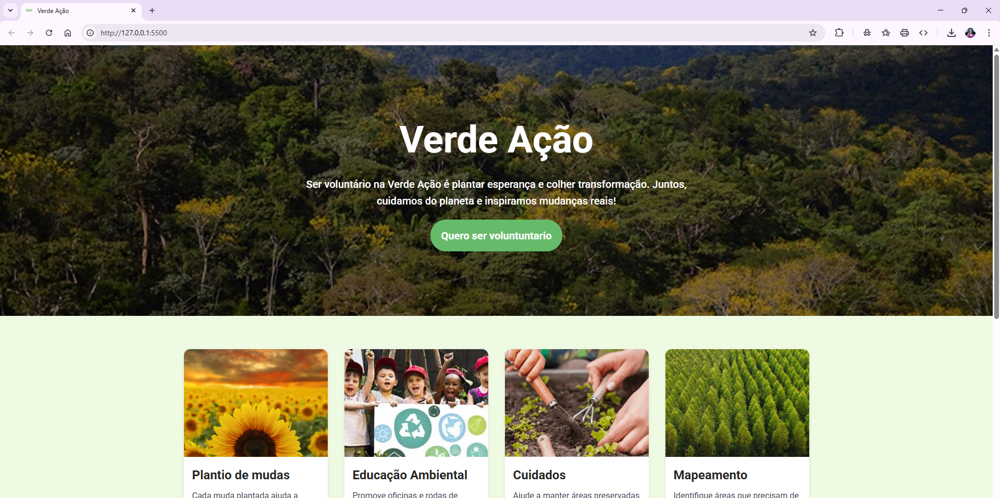

<div align="center">
  

  # 🌱 Verde Ação

  Ser voluntário no Verde Ação é plantar esperança e colher transformação.  
  Juntos, cuidamos do planeta e inspiramos mudanças reais! 💚🌍✨

  <br>

  👉 **Acesse o projeto online:**  
  https://thatianamattos.github.io/projeto-verde-acao/
</div>

---

## 🎯 Sobre o projeto

O **Verde Ação** é uma página web criada para incentivar o voluntariado, promovendo ações de cuidado ambiental,
educação ecológica e preservação de espaços naturais.

Este projeto foi desenvolvido no curso **Empower - Vai Na Web**, com foco em:

- HTML semântico  
- SASS (variáveis, nesting e componentização)  
- Responsividade  

---

## 🖼️ Prévia do projeto

### 🌿 Seção Inicial


### 🪴 Cards de Atividades
<div align="center">
  
  
</div>

### 📝 Formulário de Cadastro


---

## 🧠 Aprendizados

✔ Uso de SASS para reutilização e organização de estilos  
✔ Componentização de elementos visuais  
✔ Ajustes de responsividade  
✔ Deploy com GitHub Pages  
✔ Boas práticas de versionamento  

---

## 🚀 Como executar o projeto localmente

```bash
# Clone o repositório
git clone https://github.com/ThatianaMattos/projeto-verde-acao.git

# Acesse o diretório
cd projeto-verde-acao

# Abra no navegador
start index.html

✅ Status do Projeto

🔥 Concluído e publicado
💡 Aberto para melhorias e novas funcionalidades

👩‍💻 Desenvolvedora

Thatiana Mattos
🌈 Desenvolvedora Web Full-Stack
💚 Mãe, criativa, resiliente e apaixonada por tecnologia

GitHub → https://github.com/ThatianaMattos

LinkedIn → https://www.linkedin.com/in/thatiana-mattos/

<p align="center">Feito com carinho, café e código. 💻☕💚</p> ```
