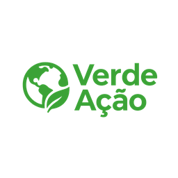
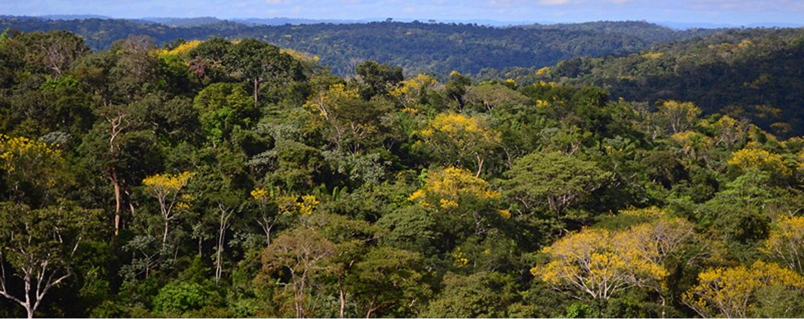
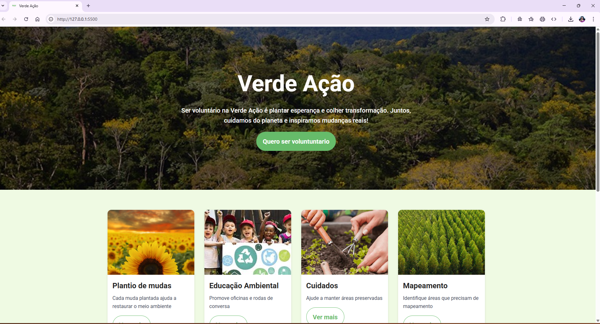
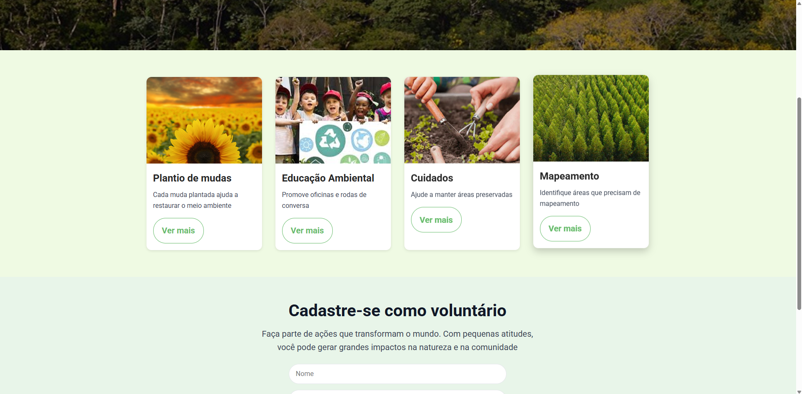
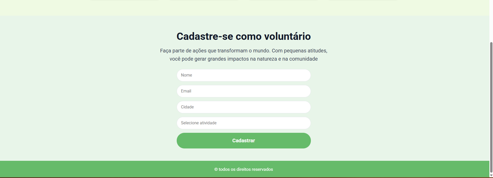

<div align="center">



# 🌿 Verde Ação

**Ser voluntário na Verde Ação é plantar esperança e colher transformação.**  
Juntos, cuidamos do planeta e inspiramos mudanças reais! 🌍✨
git a
<br>

🔗 **Acesse o projeto online:**  
https://thatianamattos.github.io/projeto-verde-acao/

</div>

---

## 🎯 Sobre o projeto

O **Verde Ação** é uma página web criada para incentivar o voluntariado, promovendo ações de cuidado ambiental, educação ecológica e preservação de áreas verdes.

Este projeto foi desenvolvido no **curso Empower - Vai Na Web**, com foco em **HTML semântico, SASS, componentização e responsividade**.

---

## 🖼️ Prévia do projeto

### 🏞️ Seção Inicial



### 🌻 Cards de Atividades

<p align="center">
  
  
</p>

### 📝 Formulário de Cadastro



---

## 🛠️ Tecnologias utilizadas

| Tecnologia       | Descrição                                        |
| ---------------- | ------------------------------------------------ |
| **HTML5**        | Estrutura da página e semântica                  |
| **SASS / SCSS**  | Estilização com variáveis, nesting e organização |
| **CSS3**         | Responsividade e aparência visual                |
| **Git & GitHub** | Versionamento e deploy                           |
| **GitHub Pages** | Hospedagem do projeto na web                     |

---

## 🚀 Como executar localmente

```bash
# Clone o repositório
git clone https://github.com/ThatianaMattos/projeto-verde-acao.git

# Acesse o diretório
cd projeto-verde-acao

# Abra o arquivo no navegador
start index.html   # (Windows)
```
