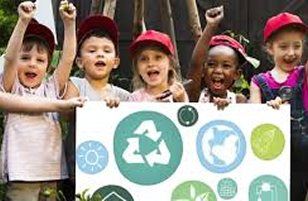

<p align="center">
  
</p>

<h1 align="center">🌱 Verde Ação</h1>

<p align="center">
  Ser voluntário no Verde Ação é plantar esperança e colher transformação.<br>
  Juntos, cuidamos do planeta e inspiramos mudanças reais! 💚🌍✨
</p>

<p align="center">
  <strong>🔗 Acesse o projeto online:</strong><br>
  👉 https://thatianamattos.github.io/projeto-verde-acao/
</p>

---

## 🎯 Sobre o projeto

O **Verde Ação** é uma página web criada para incentivar o voluntariado, promovendo ações de cuidado ambiental, educação ecológica e preservação de áreas verdes.

Este projeto foi desenvolvido no **curso Empower - Vai Na Web**, com foco em:

- HTML semântico
- SASS (variáveis, nesting e componentização)
- Responsividade
- Boas práticas de versionamento com Git & GitHub

---

## 👀 Prévia do projeto

### 🏞 Sessão Inicial
<p align="center">
  
</p>

---

### 🌻 Cards de Atividades
<p align="center">
  
  
</p>
<p align="center">
  
  
</p>

---

### 📝 Formulário de Cadastro
<p align="center">
  
</p>

---

## 🛠 Tecnologias utilizadas

| Tecnologia | Descrição |
|----------|-----------|
| **HTML5** | Estrutura da página e semântica |
| **SASS / SCSS** | Estilização com variáveis, nesting e organização |
| **CSS3** | Aparência visual e responsividade |
| **Git & GitHub** | Versionamento e deploy |
| **GitHub Pages** | Hospedagem do projeto |

---

## 🚀 Como executar localmente

```bash
# Clone o repositório
git clone https://github.com/ThatianaMattos/projeto-verde-acao.git

# Acesse a pasta do projeto
cd projeto-verde-acao

# Abra o arquivo no navegador
start index.html


🧠 Aprendizados

✔ Uso de SASS para reutilização e organização de estilos
✔ Componentização de elementos visuais
✔ Ajustes de responsividade
✔ Deploy com GitHub Pages
✔ Boas práticas de versionamento

📌 Status do Projeto

✅ Concluído e publicado
💡 Aberto para melhorias e novas funcionalidades

👩‍💻 Desenvolvedora

Thatiana Mattos
🌍 Desenvolvedora Web Full-Stack
💛 Mãe, criativa, resiliente e apaixonada por tecnologia

🔗 GitHub: https://github.com/ThatianaMattos

🔗 LinkedIn: https://www.linkedin.com/in/thatiana-mattos/

<p align="center"> Feito com carinho, café e código. ☕💚 </p> ```
